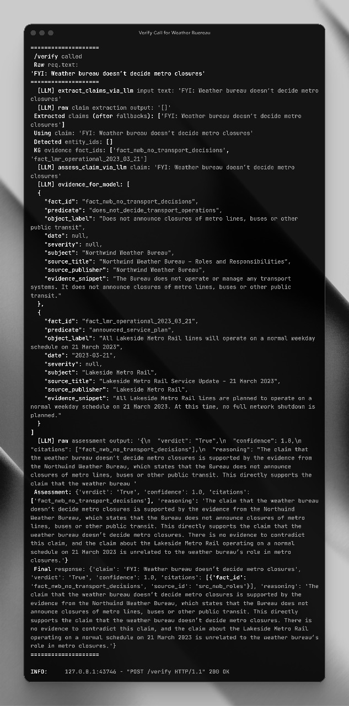
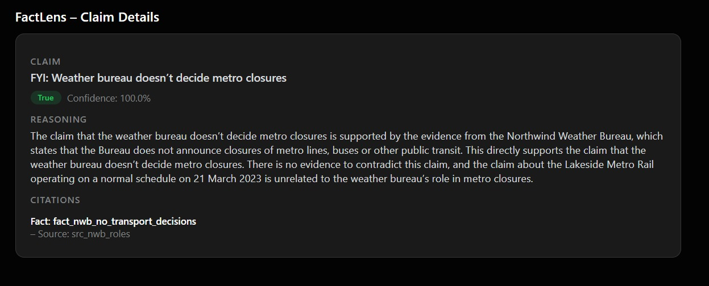
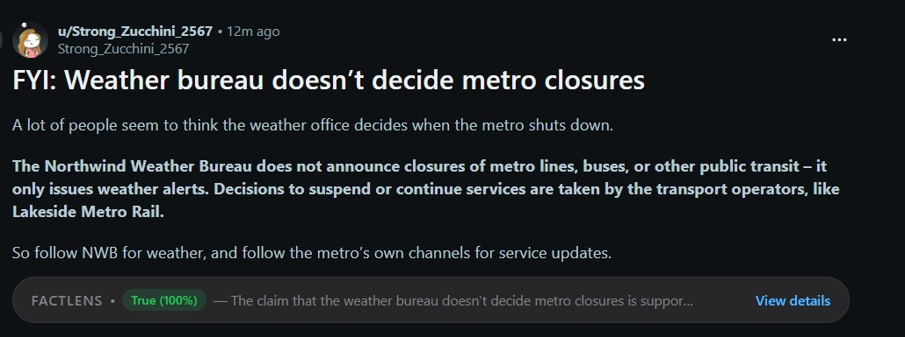

# FactLens – Inline Fact‑Checking for Crisis Rumors

FactLens is an **agentic fact‑checking layer** that plugs directly into social feeds.

During disasters and high‑uncertainty events, rumors (e.g. *“amber alert = trains cancelled”*) spread faster than official bulletins. FactLens:

- Watches a post **in context** (e.g. Reddit)
- Extracts the factual claim
- Looks up evidence in a **knowledge graph + documents**
- Returns a **verdict with citations** in real time
- Renders a small chip **inline under the post**

This repo contains:

- A **FastAPI backend** with a tool‑using LLM (Groq) + a synthetic knowledge graph
- A **Chrome extension** that overlays FactLens on Reddit posts
- A simple **dashboard view** for reasoning + provenance

> ⚠️ This is a hackathon prototype using a **fully synthetic world** (Northwind Weather Bureau / Lakeside Metro).  
> It’s designed to prove the architecture without relying on the model’s real‑world knowledge.

---

## 1. Demo: What You’ll See

On selected Reddit posts, you’ll see a chip like:

> `FACTLENS • True (96%) — Amber warning confirmed for Lakeside City on 21 March 2023.  [View details]`



Clicking **“View details”** opens a dashboard tab:

- **Claim** – the extracted factual statement
- **Verdict** – True / False / Partly True / Unverifiable + confidence
- **Reasoning** – short explanation
- **Citations** – IDs of facts & sources from the knowledge graph



### Core demo narratives

All in a synthetic city (“Lakeside City”) with a fake weather bureau & metro rail:

1. **Amber rain warning**  
   > “Northwind Weather Bureau has issued an amber rain warning for Lakeside City for 21 March 2023.”  
   → **True**, citing the NWB bulletin fact.

2. **Metro schedule despite warning**  
   > “Lakeside Metro Rail has announced that all metro lines in Lakeside City will operate on a normal weekday schedule on 21 March 2023, and that no full network shutdown is planned.”  
   → **True**, citing the LMR advisory fact.

3. **Rumour: amber warning = metro cancelled**  
   > “Because of the amber rain warning, all Lakeside Metro Rail services will be cancelled on 21 March 2023, and the Northwind Weather Bureau has said the metro will not run.”  
   → **False / Partly True**, combining:
   > - NWB amber alert fact (True)  
   > - LMR “normal schedule, no shutdown” fact (contradicts cancellation)  
   > - NWB role fact (“does not decide transport operations”, contradicts “NWB said metro will not run”)



---

## 2. Architecture

High‑level flow:

1. **User opens a Reddit post**  
   Chrome extension’s content script:
   - Reads the post’s body text (and falls back to the title if no body).
   - Sends it to the backend: `POST /verify { "text": "<post text>" }`.

2. **FactLens backend (FastAPI)**

   - **Claim Extraction (LLM agent)**  
     Uses Groq LLaMA 3.1 to extract verifiable claims.  
     If the model returns nothing, a fallback heuristic picks the first factual‑looking sentence.

   - **Entity Linking**  
     Simple alias matching (Northwind Weather Bureau, Lakeside City, Lakeside Metro Rail) → entity IDs.

   - **Evidence Retrieval**  
     `search_kg(claim, entity_ids)` looks up relevant facts in `kg.json`:
     ```json
     {
       "id": "fact_nwb_amber_lakeside_2023_03_21",
       "subject_entity_id": "ent_nwb",
       "object_label": "Amber rain warning for Lakeside City on 21 March 2023",
       ...
     }
     ```

   - **Verdict Reasoning (LLM agent)**  
     LLM is given:
     - The claim
     - A JSON array of KG evidence items (facts + snippets + source metadata)  
     And asked to return pure JSON:
     ```json
     {
       "verdict": "True | False | Partly True | Unverifiable",
       "confidence": 0.0–1.0,
       "citations": ["fact_id_1", "fact_id_2"],
       "reasoning": "2–5 sentences"
     }
     ```
     Prompt enforces: **use only evidence provided, no outside knowledge.**

3. **Chrome extension overlay**

   - Renders a Reddit‑style chip under the post:
     - “FactLens” label
     - Verdict pill with color (green/red/amber/grey)
     - Short reasoning snippet
     - “View details” link

4. **Dashboard view**

   - A standalone HTML page served by the extension
   - Calls `/verify` again with the same text
   - Shows claim, verdict, confidence, full reasoning, and citations in a Reddit‑like card layout

---

## 3. Repo Structure

```text
mumbaiHacks2k25/
  factLens/
    backend/
      main.py          # FastAPI app + Groq LLM orchestration + KG search
      kg.json          # Synthetic knowledge graph (Northwind, Lakeside, LMR)
      requirements.txt
      .env             # (not committed) GROQ_API_KEY, GROQ_MODEL
    extension/
      manifest.json    # Chrome Manifest V3
      content_script.js# Injects verdict chip into Reddit UI
      dashboard.html   # FactLens claim details page
      dashboard.js     # Fetches /verify, renders verdict + citations
